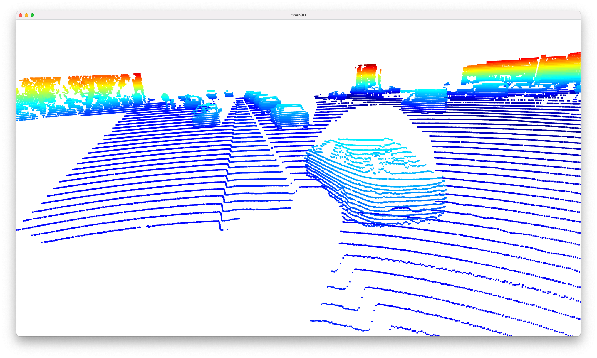
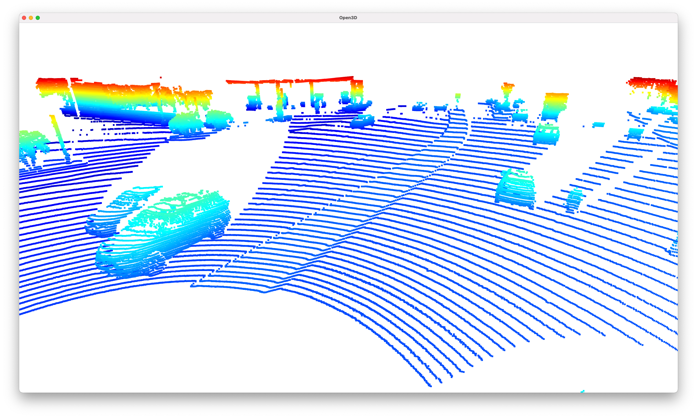

# Writeup: Midterm project

## Point cloud images & features analysis

All the point cloud images are taken from `training_segment-1005081002024129653_5313_150_5333_150_with_camera_labels.tfrecord`.
Possible features (recognizable car parts and characteristics) are mentioned within title of each image.

### Images

#### 01 - Wheels, front bumper, front window (windshield), side windows

#### 02 - Wheels (especially good in side view), front bumper, front window (windshield), side windows, hood

#### 03 - Wheels, rear bumper, side windows, boot (trunk)

#### 04 - Wheels, rear bumper, side windows, tail lights, outside mirrors, rear window

#### 05 - Outside mirrors, wheels, trunk (pickup truck on the right)

#### 06 - Wheels, side silhouette 

#### 07 - Wheels, rear bumper, windows, 

#### 08 - Outside mirrors, wheels, front bumper 

#### 09 - Wheels, hood, windows (car in the back), front fender

#### 10 - Wheels, rear window, boot (trunk), rear fender, front fender
I would like to mention, there is car in image where only front wheel visible so tracking system should definitely deal also with scenarios like this. 

#### 11 - Wheels

#### 12 - Hood, wheels of the trailer

#### 13 - High truck in the middle of the image - clearly visible wheels and large tailgate

#### 14 - Rear bumper, wheels, boot (trunk)

#### 15 - Rear window, side windows, outside mirrors

## Range image
- `top` - distance to the point
- `bottom` - intensity of the reflection

## BEV (bird's eye view) of the aggregated points from the point cloud
Image description:
- `red` - density of the points
- `blue` - maximum intensity within pack of points
- `green` - maximum height within pack of points
- `RGB` - RGB combination of all the above

## Metrics

Specification of used data:
- `data_filename = 'training_segment-1005081002024129653_5313_150_5333_150_with_camera_labels.tfrecord`
- `show_only_frames = [50, 150]`

### Computed metrics
- `precision = 0.9376237623762375`
- `recall = 0.9496699669966996`

