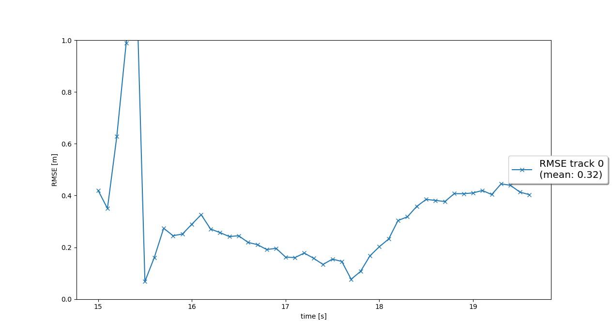
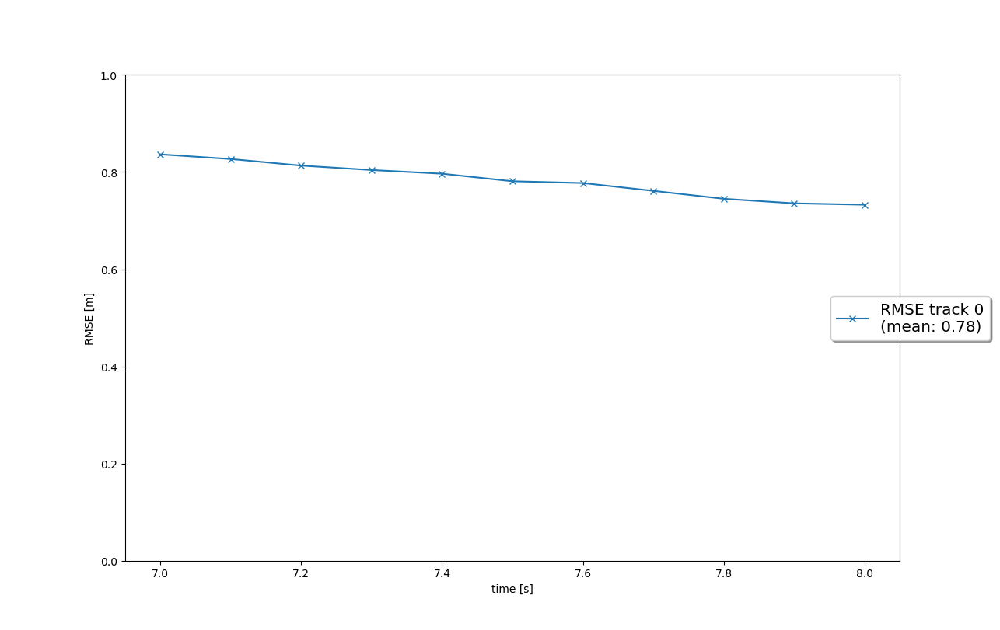
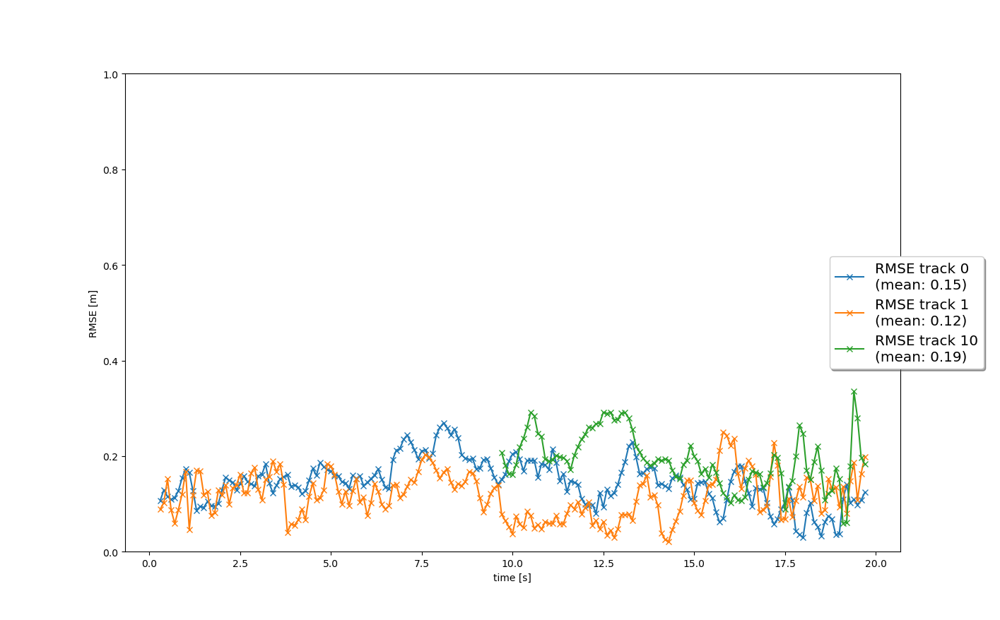

# Writeup: Track 3D-Objects Over Time

### 1. Write a short recap of the four tracking steps and what you implemented there (filter, track management, association, camera fusion). Which results did you achieve? Which part of the project was most difficult for you to complete, and why?

At first, I have implemented **EKF** (Extended Kalman's filter) to track single target using lidar data only. Tracked
object was defined in six dimensions - 3D space coordinates and constant velocity in each axis. I have achieved RMSE (
Root mean square error) = `0.32`.

In the next part of the project, **track management**, I have added logic to take care of multiple tracks initialisation
and track state (`initialised`, `tentative`, `confirmed`) & score handling. Old tracks are removed when certain
conditions are met - low score and/or position out of reasonable bounds. Achieved RMSE = `0.78`.

In third part, I utilized EKF and track management from previous tasks and implemented **nearest neighbor data
association** to assign specific measurement to according track. Gating method based on χ² (chi-squared) distribution is
applied to filter unlikely associations. Three tracks were detected and correctly associated on used data. RMSE is
below `0.2` for the tracks visible from the beginning of the sequence.

Previous tasks were based only on lidar data. In this step I have added support to process also camera data and finalize
**camera-lidar sensor fusion**. I have implemented non-linear camera measurement function and measurement (`z` vector
and measurement covariance matrix `R`). To make sure that tracks' score are not penalised when camera cannot see objects
on an image, implemented FOV (field of view) function is used to skip scoring when appropriate.

I consider this part most difficult because small errors or typos in matrices are hard to debug. You always have to be
sure what coordinates you're currently working with and make sure to transform between sensor a vehicle coordinates when
necessary.

<video src="https://user-images.githubusercontent.com/5667370/165120617-718554e9-860f-49bc-89de-fbe411973a9f.mp4" controls="controls" style="max-width: 730px;">
</video>

[Link to download video](https://github.com/skywall/nd013-c2-fusion-starter/blob/main/img/multi_target_track_detection_preview.mp4)

### 2. Do you see any benefits in camera-lidar fusion compared to lidar-only tracking (in theory and in your concrete results)?

Data from multiple sources are often a good approach to improve our models. Camera images give us a new perspective on
the data and allow us to get new and valuable features of the analysed scene. There are few examples:

- Detection of objects with unusual shapes - for example fences might be tricky for lidar since beam can hit space
  between panels.
- We know color of the tracked objects - allow us to recognize if breaking lights are on, if the car is an ambulance
  etc.

### 3. Which challenges will a sensor fusion system face in real-life scenarios? Did you see any of these challenges in the project?

There are plenty of challenges in real-life scenarios. Sensors data might be delayed, thus not processed within
current "processing frame". Sensors might break or be covered with dirt what makes them produce invalid data or no data
at all. Sensor data processing itself is computationally heavy operation and we have to consider if we are able to
provide results fast enough to safely drive vehicle in real traffic.

Project is based on predefined and isolated environment, so I consider it more like a playground than real world
tracking tool. I really appreciate a real world dataset is used so we're working with captured data and not a made up
ones.

### 4. Can you think of ways to improve your tracking results in the future?

There are plenty of ways to improve tracking results. Here are few of them:

- Use data from more than one lidar sensor - for example side lidars could detect cars sooner and better keep track of
  them.
- I consider camera data more error-prone and thus I would recommend do some additional experiments with used model -
  use model with different input image size, optimize hyperparameters, try different architectures etc.

